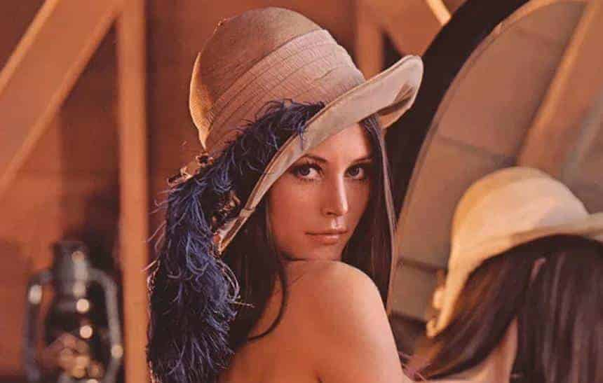

# Aula 2 - 25/08/2025

# Sobre o rasterLab

Na pasta [rasterLab](../rasterLab/) você encontrará uma aplicação Web que ajuda a processar uma imagem raster usando Javascript.

Durante algumas de nossas aulas usaremos essa aplicação para estudarmos alguns filtros e processamento de imagens raster.

## Como usar?

* Clonar esse repositório ou fazer o download da pasta localmente.
* Abrir a pasta rasterLab no VSCode.
* Editar o arquivo `main.js`

### Como adicionar uma imagem?

Carregue uma imagem para processamento usando o botão!!!!

### Sobre a Lena

A imagem da Lena (ou Lenna) é uma das mais famosas na história do processamento de imagens digitais.

#### Origem da Imagem
- A imagem original é um recorte de um pôster da **Playboy de novembro de 1972**, que mostrava a modelo sueca **Lena Söderberg (ou Lenna, na grafia original)**.
- Em 1973, pesquisadores do **Signal and Image Processing Institute da University of Southern California (USC)** precisavam de uma imagem para testar algoritmos de compressão e processamento de imagens.
- Eles recortaram a foto de Lena (mostrando apenas a parte do ombro e rosto) e a digitalizaram.

#### Por que ficou famosa?
- A imagem tinha características úteis para testes: **detalhes suaves (pele), bordas bem definidas (chapéu, penas), texturas variadas**.
- Tornou-se um **padrão** em pesquisas de processamento de imagens, compressão (como JPEG) e visão computacional durante décadas.

#### Controvérsias
- Com o tempo, a origem da imagem passou a gerar debates sobre **questões éticas, objetificação de mulheres e inclusão no meio científico**.
- Algumas instituições passaram a desencorajar o uso da imagem, incentivando alternativas mais neutras e representativas.

#### Status Atual
- Embora ainda seja reconhecida e usada em contextos históricos, **o uso da imagem de Lena tem diminuído** por razões éticas.

### Como adicionar um filtro

* Criar um arquivo de filtro. Na pasta [filtros](../rasterLab/filtros/) você encontrará um template para sua função de filtro.

~~~js
function filterName(imageLab) {
    for(let y=1; y <= imageLab.image1.height; y++) {
        for(let x=1; x <= imageLab.image1.width; x++) {
            let pixel = imageLab.image1.getPixel(x,y)

            // processamento de cada pixel da imagem

            imageLab.image2.setPixel(x,y,pixel)
        }
    }
    imageLab.image2.refresh()
}

export default filterName
~~~

Você deve alterar o nome da função e ajustar a exportação.

No arquivo `main.js`, você deve importar a função criada e adicionar no vetor passado como parâmetro na função `createFilters`.

~~~js
{ label: 'Nome do filtro', method: nomeDaFuncao }
~~~

